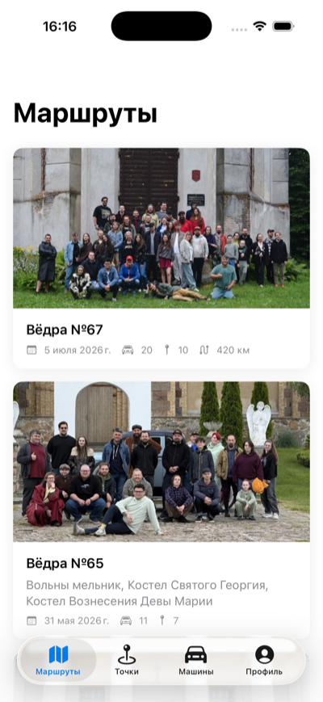
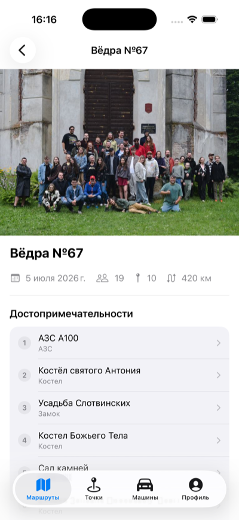
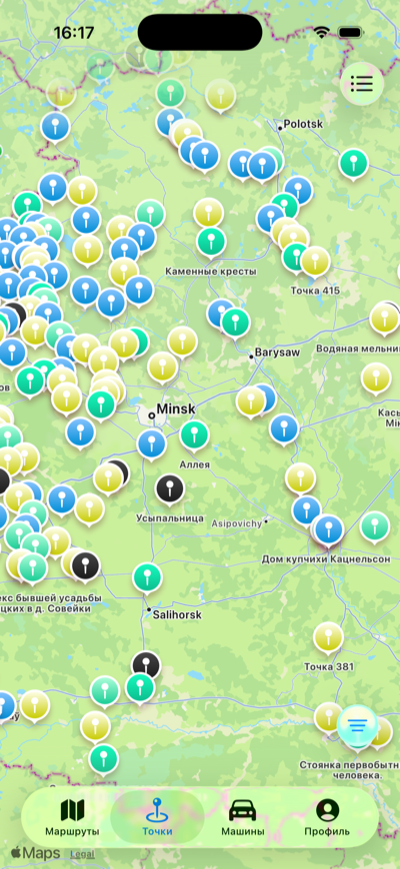
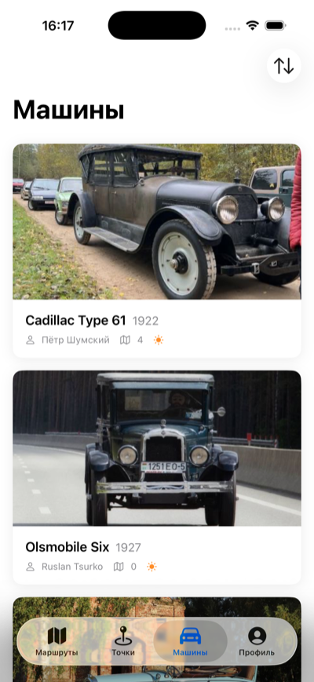
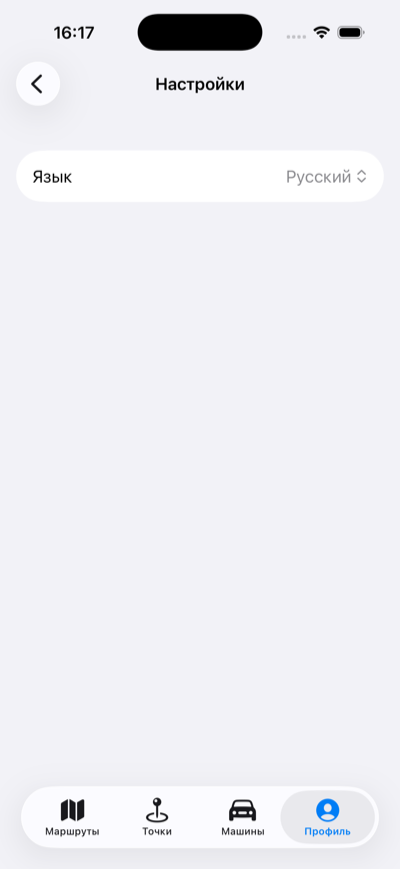

# Viadrouniki iOS

A SwiftUI client for the [viadrouniki.by](https://viadrouniki.by) travel API — road trips, points
of interest and the cars that drive them, across Belarus.


Built as a pet project against a live public API: ~3,900 lines of Swift across 50 files, no
third-party packages, MVVM on the Observation framework.

---

## Screenshots

<table>
  <tr>
    <td></td>
    <td></td>
    <td></td>
    <td></td>
    <td></td>
  </tr>
  <tr>
    <td align="center"><sub>Trips</sub></td>
    <td align="center"><sub>Trip detail</sub></td>
    <td align="center"><sub>Points map</sub></td>
    <td align="center"><sub>Cars</sub></td>
    <td align="center"><sub>Language</sub></td>
  </tr>
</table>

---

## Features

Four tabs, defined in [`App/ContentView.swift`](viadrouniki_ios_app/App/ContentView.swift).

**Trips** — a paginated card list of road trips. Tapping through opens a detail screen with a
photo hero gallery, a stats row (date range, participants, attraction count, route length), the
meeting point, and two linked sections: the trip's ordered **attractions** (each pushes to its
point) and the **cars** that took part.

**Points** — points of interest, toggling between a list and a `MapKit` map. The list is
searchable with a 400 ms debounce; the map centres on Belarus and tints each marker by attraction
type, with a filter sheet that separates attraction categories from amenities and names the
"no type / unknown type" case explicitly. Point details show location, photos, and the trips that
visit it.

**Cars** — a paginated list sortable by year, brand, or trip count in either direction. Details
carry the owner (with an Instagram link-out) and the car's own trips.

**Profile** — account details, linked accounts, and settings. Google sign-in is currently a stub;
see [Known limitations](#known-limitations).

Cross-cutting: pull-to-refresh and infinite scroll on every list, a native launch screen that
hands off to a matching SwiftUI splash, and a **Russian ⇄ Belarusian** language switch that
re-localizes the UI *and* refetches API content.

---

## Architecture

MVVM on the Observation framework. Dependencies point downward only:

```
View (SwiftUI struct)
  └─> ViewModel (@Observable final class)
        └─> APIClient.shared  (extension per domain)
              └─> Model (struct, Codable, Hashable)
```

```
viadrouniki_ios_app/
├── App/          entry point, TabView root, AppViewModel
├── Models/       Trip, Point, Vehicle, AppUser, AppLanguage, response envelopes
├── Network/      APIClient + one APIClient+<Domain>.swift extension per resource
├── ViewModels/   <Domain>ListViewModel / <Domain>DetailViewModel
├── Views/        one folder per feature, plus Components/ for shared views
└── Utilities/    AuthTokenStore, KeychainStore
```

Two rules hold throughout:

- **Views hold no business logic and make no network calls**; **ViewModels don't import SwiftUI**
  — they expose data and let Views decide presentation.
- **`Models/` never imports SwiftUI.** When a model needs a `Color`, an SF Symbol or a size class,
  that lives in a `<Type>+<Purpose>.swift` extension under `Views/Components/` — see
  [`AttractionType+Presentation.swift`](viadrouniki_ios_app/Views/Components/AttractionType+Presentation.swift)
  and [`PhotoResource+SizeClass.swift`](viadrouniki_ios_app/Views/Components/PhotoResource+SizeClass.swift).
  A SwiftUI import appearing under `Models/` means something landed in the wrong folder.

Every network call goes through an `extension APIClient`; endpoint functions build a URL and
return `try await get(url:)`, while a single `perform(_:)` maps status codes and decode failures
onto [`APIError`](viadrouniki_ios_app/Network/APIError.swift).

---

## Engineering notes

The parts of this project that were more interesting than they look.

### App-controlled localization

iOS ships **no Belarusian display language** — it isn't in the system list, so it can't be chosen
in Settings and the per-app language picker can't offer it either. The system language is
therefore deliberately not consulted:
[`AppLanguage`](viadrouniki_ios_app/Models/AppLanguage.swift) is a `UserDefaults`-backed source of
truth that the app forces onto the view tree with `.environment(\.locale, language.locale)`.

Two things that don't work the way you'd expect fall out of that:

- **`.navigationTitle` and `.tabItem`'s `Label` don't re-resolve a `LocalizedStringKey` on an
  environment-only locale change** — for whichever screen or tab is on screen at that moment. The
  key compares equal, so SwiftUI has nothing to diff and the UIKit-bridged bar keeps the old
  language. `AppLanguage.localized(_:)` pre-resolves to a `String` off an `@Observable` dependency
  so the value genuinely differs and the update is forced through. (Confirmed by A/B test, not
  inferred: reverting one screen reproduces a Russian title above Belarusian content.)
- **`String(localized:locale:)` ignores `locale` for the *lookup*** — that argument only formats
  interpolated values, while the translation goes through the *device's* preferred localization.
  Passing `bundle:` is what actually selects the language outside SwiftUI.

### A language switch has to refetch

The `locale` query param is baked into responses the ViewModels already hold, so re-localizing the
UI isn't enough — the API content has to be fetched again. Every content screen keys its `.task`
on `@Environment(\.locale)`.

Where a `.task` already had a key, the language joins it in **one** `Equatable` struct
(`PointsRequest`, `VehiclesRequest`) rather than becoming a second `.task` — two tasks calling the
same fetch both fire on appear and race. The map's load is guarded on a stamped
`loadedMapLocale` rather than on `mapPoints.isEmpty`, so a list ⇄ map toggle doesn't refetch but a
language change still does.

The obvious alternative — `.id(language)` at the root — refetches by destroying the tree, taking
every `NavigationStack` path and scroll position with it. It was the original approach, and it's
documented in-place as a dead end.

### The API's response envelopes are not uniform

Four different shapes are in play, and choosing wrong fails at **runtime**, not compile time:

| Shape | Used by |
|---|---|
| `{"data": [...], "meta": {...}}` | paginated lists |
| `{"data": ...}` | single resources, and *some* collections |
| bare top-level array | `attractions/map` |
| `{"user": ...}` | `auth/me` |

One more non-obvious detail: `Accept: application/json` is set on every request and is
**load-bearing**. Laravel emits a JSON 401 only when the request asks for JSON — without the
header, an unauthenticated call to a protected route returns **500 with an HTML body**, which
makes `APIError.unauthorized` unreachable and any `catch` for it dead code.

### The app icon is generated, not drawn

The three appearance variants (light / dark / tinted) and the launch-screen logo are build output,
produced from one source SVG by [`IconSource/make-app-icon.py`](IconSource/make-app-icon.py). The
glyph's centre is **measured** from a trial render rather than hardcoded, because the failure it
prevents is invisible — a stale constant emits an off-centre icon in all three appearances with no
error and a green build. The script also refuses to run on input it can't measure reliably.

Icon Composer (`.icon`) was tried first and abandoned: its per-appearance override couldn't be made
to take, and there's no CLI to verify against.

---

## Getting started

**Requirements:** macOS with Xcode providing the **iOS 26.5** SDK. No package manager step — the
project has zero third-party dependencies.

```bash
git clone https://github.com/NikitaDemedyuk/viadrouniki_ios_app.git
cd viadrouniki_ios_app
open viadrouniki_ios_app.xcodeproj
```

Then ⌘R. The app browses public read-only endpoints, so it runs with **no configuration, no API
key and no account**.

To build from the command line:

```bash
xcodebuild -scheme viadrouniki_ios_app -destination 'generic/platform=iOS Simulator' build
```

> **Note:** the repo carries no *shared* scheme, so Xcode auto-creates one on first open. Open the
> project in Xcode once before running `xcodebuild -scheme`, or it won't resolve.

To exercise the signed-in Profile screens while Google sign-in is still a stub, set
`VIADROUNIKI_DEBUG_TOKEN` in the scheme's environment variables (Product ▸ Scheme ▸ Edit Scheme ▸
Run ▸ Arguments). It's read under `#if DEBUG` only, in
[`ViadrounikiApp.swift`](viadrouniki_ios_app/App/ViadrounikiApp.swift) — use an unshared scheme
copy and never commit a token.

### Project conventions

`develop` is the integration branch and the base for every PR; feature branches follow
`feature/<slug>`. The target uses `PBXFileSystemSynchronizedRootGroup`, so new `.swift` files
dropped into the right folder are picked up with no `project.pbxproj` edit. There is currently
**no test target**.

Full conventions — build settings, API rules, the localization checklist — live in
[`CLAUDE.md`](CLAUDE.md).

---

## Known limitations

Stated plainly, because they're deliberate rather than overlooked.

- **Google sign-in is a stub.** The backend's `auth/google/redirect` is web-only: it hardcodes its
  `redirect_uri` and ignores `redirect`/`state`, and `viadrouniki.by` serves no
  apple-app-site-association — so there is no route back into the app. The fix is
  `ASWebAuthenticationSession` against a custom scheme, once the backend whitelists one. Everything
  downstream (Keychain token storage, the authed endpoints, the signed-in Profile) is built and
  works against an injected token.
- **No test target, and therefore no DI layer.** All six ViewModels call `APIClient.shared`
  directly. The cost is understood and accepted: ViewModels can't currently be unit-tested without
  hitting the network. Adding a protocol + DI layer is its own task covering all six at once —
  doing it for one feature would make the codebase less consistent, not more.
- **No write path yet.** The app is read-only over GET. "Add car" and the Telegram settings rows
  are visible but inert placeholders rather than guessed-at request shapes.
- **`Vehicle` vs. `cars` is intentional.** The model type is `Vehicle`, the endpoint is `cars`, and
  the UI says «Машины». Renaming to match is its own task across every `Vehicle*` type at once, not a drive-by fix.
- **Known backend gap:** `attraction-types` returns Russian names even for `locale=be`.

---

<sub>An unofficial client built against the public viadrouniki.by API. Not affiliated with
viadrouniki.by; all trip, point and car content belongs to that service and its contributors.</sub>
